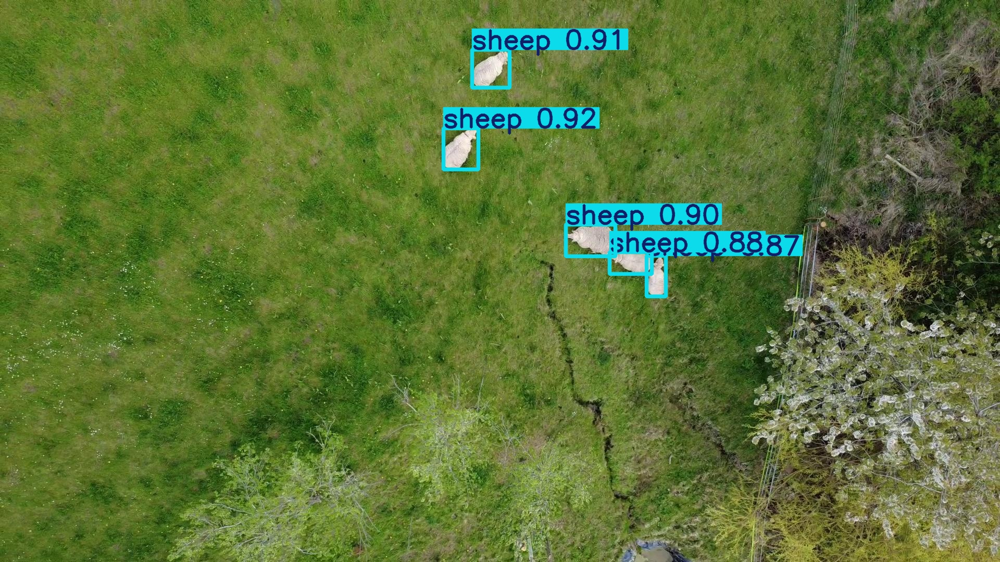
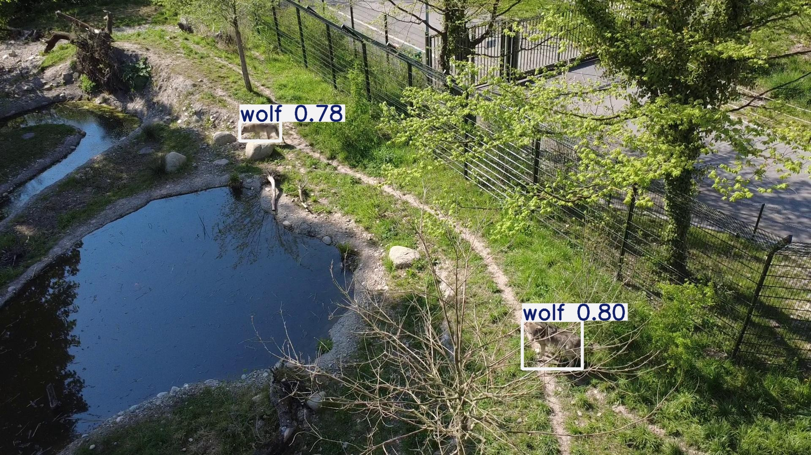

# 📘 Wolf Detection AI
## 🔗 Online Access

- This project was developed as part of the thesis: <https://drive.google.com/drive/folders/1ag495ByeFjiVlfqUUsdaL6ZCu044Agzx>
- GitHub Repository of Thesis: <https://github.com/jostoelz/Autonomous-Drone-System-for-Wolf-Detection-Deterrence-and-Sheep-Protection>

## 🔍 Abstract
The objective of this project was to develop an AI-driven system capable of distinguishing wolves from sheep and dogs to ensure that drone-based deterrence measures are applied exclusively to wolves. The data collection process involved acquiring drone footage from the Lange Erlen Zoo in Basel and the wildlife park in Feldkirch, complemented by recordings of sheep and dogs from various pastures. To manage the large volume of data, the one-shot model "Language Segment-Anything" was used to generate initial bounding boxes, which were then manually reviewed and corrected using Roboflow. The final dataset was enhanced through augmentation techniques such as cropping and mirroring, and integrated with existing online datasets to reach a total of 73,057 images.
The neural network was developed by fine-tuning a YOLOv8s (small) model in Google Colab over 70 epochs with an image size of 640 pixels and a batch size of 64. Training utilized 67,398 images and was completed in 5.57 hours. The resulting model demonstrated high accuracy, achieving a precision of 0.96, a recall of 0.93, and a mAP50 of 0.96. When deployed on a Raspberry Pi, the system operates at an average speed of 1.12 FPS with an inference time of 889.97 ms. Real-world testing confirmed the model's ability to successfully detect wolves, sheep, and dogs across different environments, providing a functional foundation for automated livestock protection.

## 📖 Citation

If you find this project useful for your research, please consider citing it:

```bibtex
@software{Stoelzle2024,
  author       = {St{\"o}lzle, Johannes},
  title        = {Wolf Detection AI },
  year         = 2025,
  url          = {[https://github.com/jostoelz/Wolf-Detection-AI)}
}
```

## 🧭 Visual Overview

<p align="center">
  
  <br/>
  <em>Multi-object detection of sheep in an open field.</em>
</p>

<p align="center">
  
  <br/>
  <em>Wolf detection in a wildlife park enclosure.</em>
</p>

## 📜 License

[](https://opensource.org/licenses/Apache-2.0)

This project is licensed under the Apache License 2.0 - see the [LICENSE](LICENSE) file for details.

---
✨ Enjoy exploring the thesis materials. 
